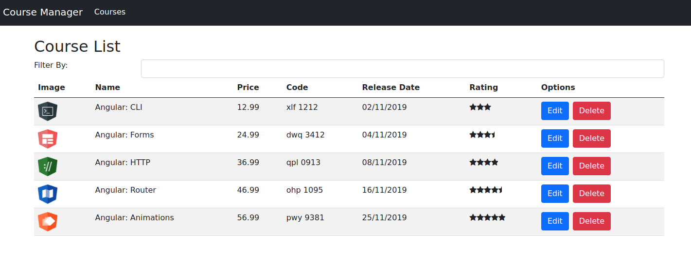

## Uma página de apresentação de cursos com breve descrição

## Como executar:

 - Primeiro navegue até `cd: /src/assets/serve`
 - Rode o comando `node serve.js`

Para executar o servidor de **backend** ~~falso~~;

## A seguir:

 - Rode o comando `npm install` para instalar as dependências;
 - Para iniciar o projeto digite `npm run start`
 

  

Projeto feito em curso de Bootcamp;